📘 Documentation – MongoDB Replica Set Setup Simulation (Production-Oriented)
=============================================================================
<div style="display: flex; flex-wrap: wrap; justify-content: center; gap: 10px;">

<!-- Ligne 1 -->
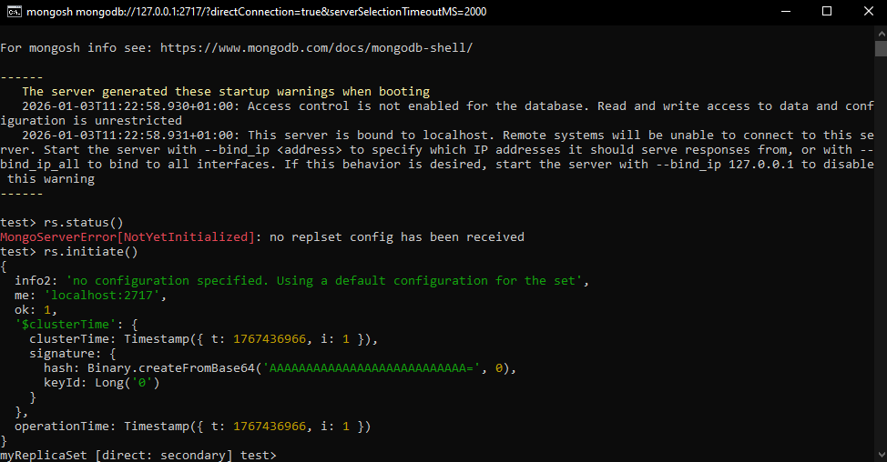
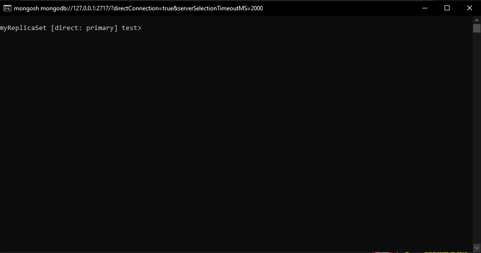
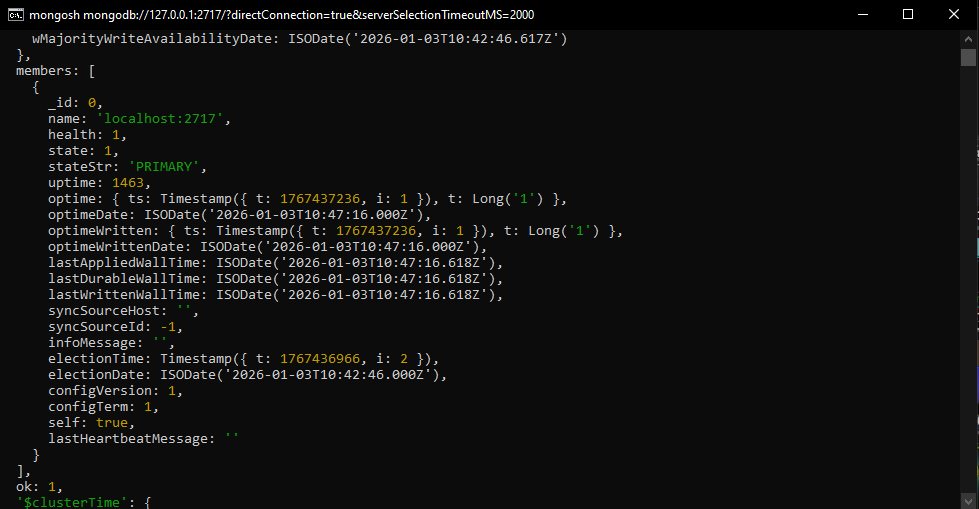
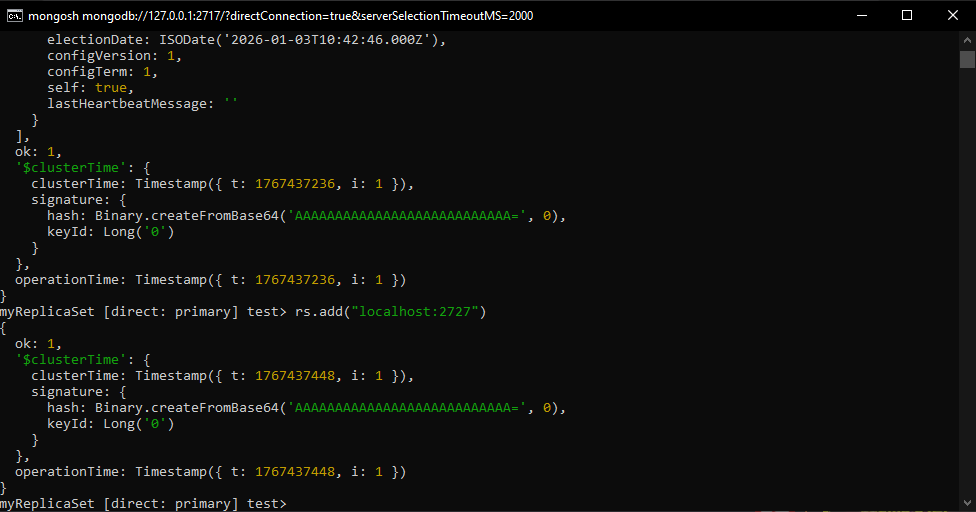

<!-- Ligne 2 -->
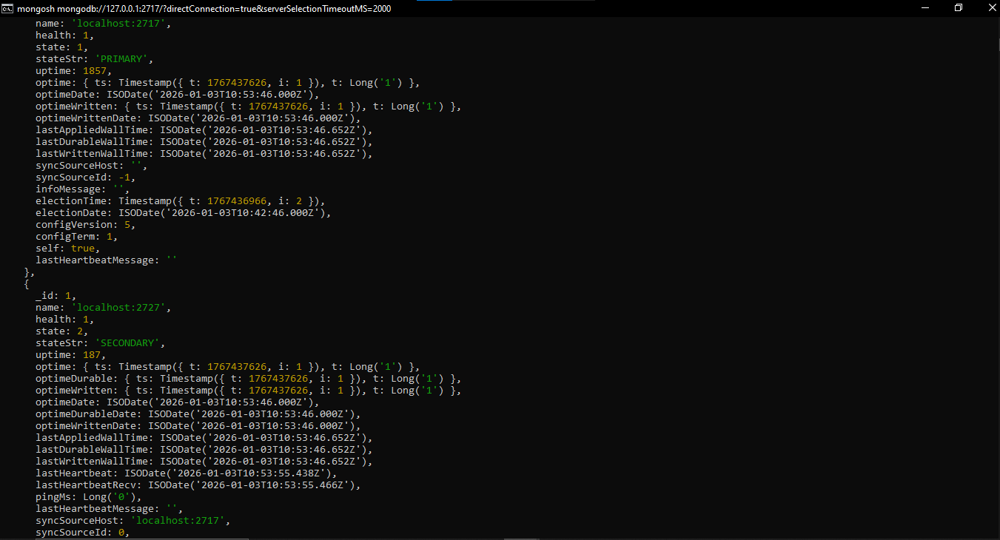
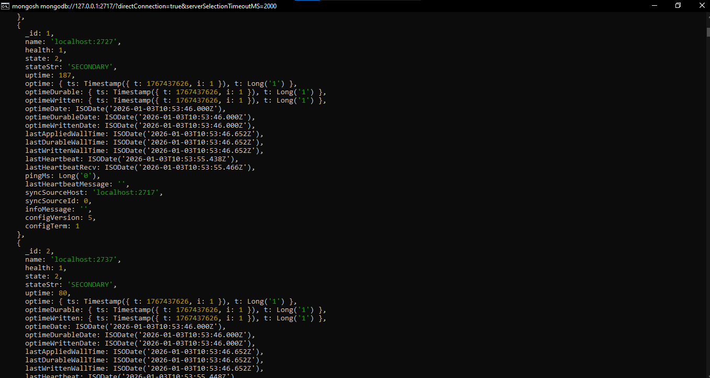
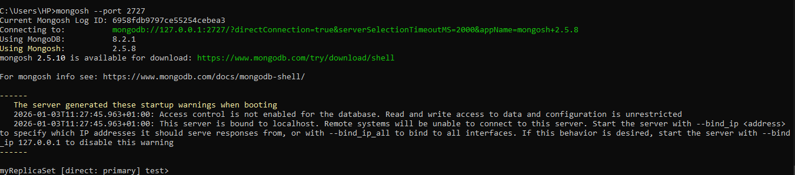
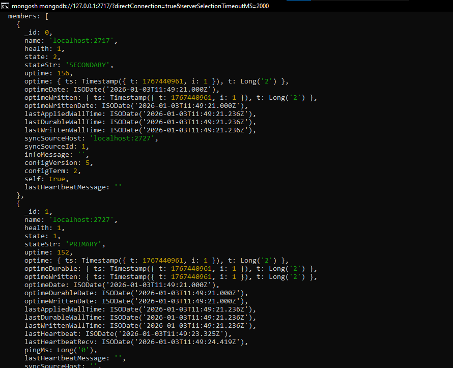

<!-- Ligne 3 -->
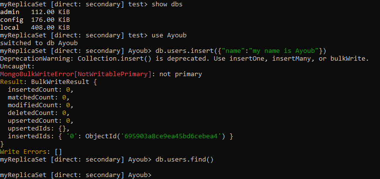
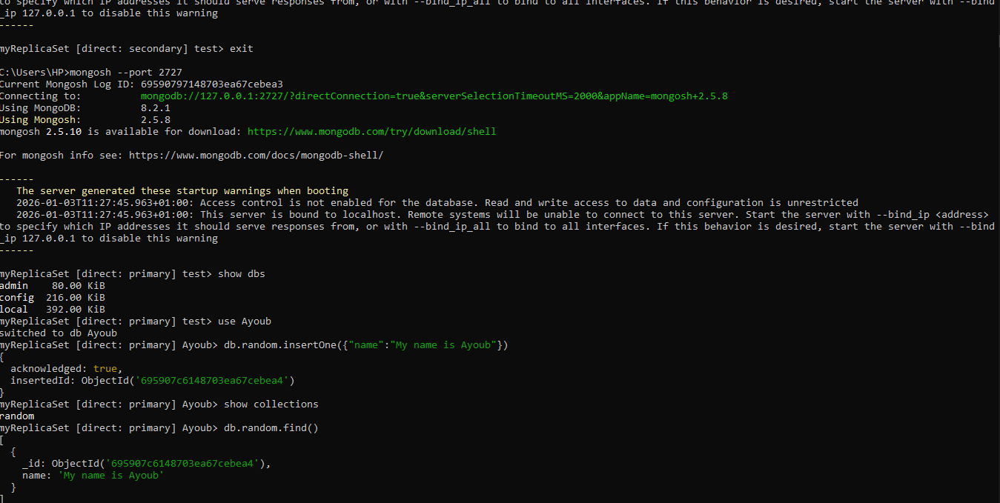
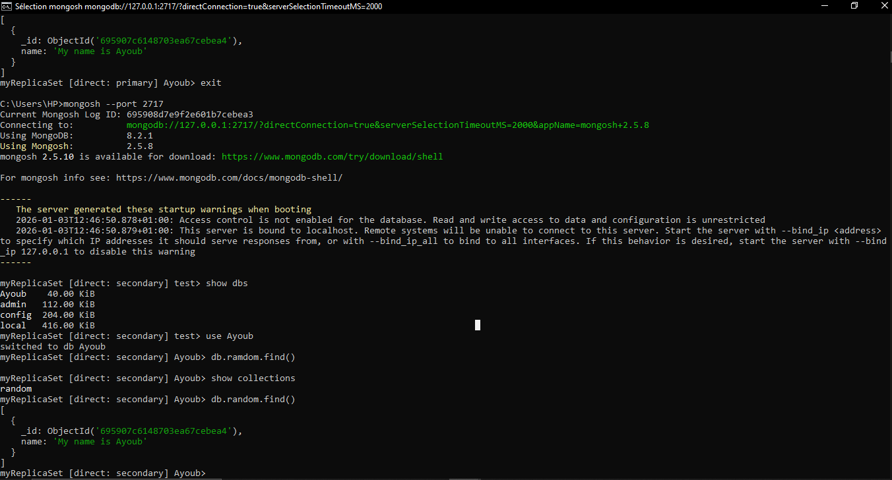
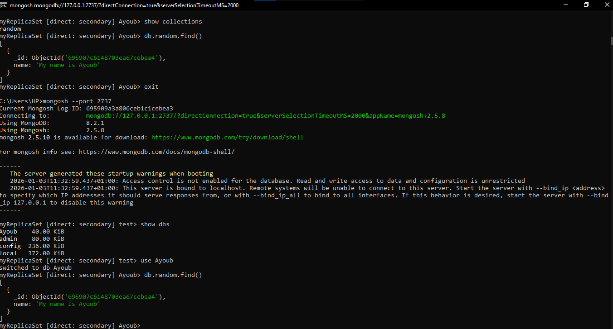

</div>


Replica Set Name: `myReplicaSet`
--------------------------------

* * *

1️⃣ Simulation Objective
------------------------

The objective of this simulation is to **set up and operate a MongoDB Replica Set cluster** in a production-like environment in order to:

*   Understand the roles of **Primary** and **Secondary** nodes
*   Observe **automatic elections**  
*   Test **data replication**
*   Verify **write restrictions**
*   Diagnose **real-world production errors**
    

* * *


## 2️⃣ Environment Used

| Element             | Value               |
| ------------------- | ----------------- |
| OS                  | Windows           |
| MongoDB             | 8.2.1             |
| mongosh             | 2.5.8             |
| Deployment Type     | Local (simulation)|
| Mode                | Replica Set       |


* * *

3️⃣ Connection to the Initial Primary Node
------------------------------------------

Connection to MongoDB server on port **2717**:

    mongosh --port 2717
    

Result:

*   Successful connection
*   Node is **Primary**
*   Active Replica Set: `myReplicaSet`
    

* * *

4️⃣ Initial Replica Set Status Check
------------------------------------

Executed command:

    rs.status()
    
### 🔍 Observation

*   `votingMembersCount: 1`
*   `stateStr: PRIMARY`
*   Only one active node
*   No fault tolerance yet
    
👉 The Replica Set is operational but **not redundant**

* * *

5️⃣ Adding Secondary Nodes
--------------------------

### ➕ Add first Secondary

    rs.add("localhost:2727")
    

### ➕ Add second Secondary

    rs.add("localhost:2737")
    

* * *

6️⃣ Cluster Status After Adding Nodes
-------------------------------------

    rs.status()
    

### 🔍 Result

| Element            | Value          |
| ------------------ | -------------- |
| Total nodes        | 3              |
| Primary            | localhost:2717 |
| Secondary          | localhost:2727 |
| Secondary          | localhost:2737 |
| votingMembersCount | 3              |
| writeMajorityCount | 2              |


✅ The cluster is now **highly available**

* * *

7️⃣ Shell Behavior Test (`rs.status` vs `rs.status()`)
------------------------------------------------------

Incorrect command:

    rs.status
    

Result:

*   Returns a **function reference**
*   No execution
    

Correct command:

    rs.status()
    

👉 This highlights the difference between:

*   **Function reference**
*   **Function execution**
    

* * *

8️⃣ Restart and Temporary Connection Loss
-----------------------------------------

Reconnection attempt:

    mongosh --port 2717
    

Result:

    MongoNetworkError: connect ECONNREFUSED
    

### 🔍 Interpretation

*   The node on port 2717 was **down**
*   The Replica Set triggered an **automatic election**
    

* * *

9️⃣ New Election Observation
----------------------------

Connection to another node:

    mongosh --port 2727
    rs.status()
    

### 🔍 Result

*   `localhost:2727` becomes **PRIMARY**
*   `localhost:2717` becomes **SECONDARY**
*   `term` incremented (moved to `term: 2`)
    

✅ **Fault tolerance confirmed**

* * *

🔟 Write Attempt on a Secondary (Expected Failure)
--------------------------------------------------

Connection to a Secondary:

    mongosh --port 2717
    

Insert attempt:

    db.users.insert({ "name": "my name is Ayoub" })
    

Result:

    MongoBulkWriteError[NotWritablePrimary]: not primary
    

### 🧠 Explanation

*   **Write operations are forbidden** on Secondary nodes
*   Only the **Primary** accepts writes
    

✅ Normal production behavior

* * *

1️⃣1️⃣ Data Insertion on the Primary
------------------------------------

Connection to the Primary:

    mongosh --port 2727
    

Successful insert:

    db.random.insertOne({ "name": "My name is Ayoub" })
    

Result:

    acknowledged: true
    

* * *

1️⃣2️⃣ Replication Verification
-------------------------------

Connection to a Secondary:

    mongosh --port 2717
    

    use Ayoub
    show collections
    

Result:

*   The `random` collection is present
    
*   Data has been **automatically replicated**
    

✅ Replication is functional

* * *

1️⃣3️⃣ Encountered Issue: BSON / UTF-8 Error
--------------------------------------------

Observed error:

    BSONError: Invalid UTF-8 string in BSON document
    

### 🔍 Identified Cause

*   MongoDB version **8.2**
*   Feature Compatibility Version:
    
```bash
    db.system.version.find()
    { version: "8.2" }
```   

👉 Version is too recent → instability with some commands (`rs.status()`)

* * *

1️⃣4️⃣ Security Warnings (Non-Production Mode)
----------------------------------------------

At startup:

    Access control is not enabled
    Server is bound to localhost
    

### 🔐 Interpretation

*   No authentication enabled
*   Access restricted to `localhost`
*   Acceptable for **simulation**
*   ❌ Not recommended for production
    

* * *

1️⃣5️⃣ Results and Skills Acquired
----------------------------------

### ✅ Validated Skills

*   Replica Set setup
*   Dynamic node addition
*   `rs.status()` analysis
*   Election mechanism understanding
*   Handling `NotWritablePrimary` errors
*   Automatic data replication
*   BSON / FCV issue diagnostics
    

* * *

1️⃣6️⃣ Conclusion
-----------------

This simulation successfully reproduced a **production-like MongoDB environment**, demonstrating:

*   Real Replica Set behavior
*   High availability
*   Write limitations
*   Automatic elections
*   Version-related errors
    
It provides a **solid foundation** for backend, DevOps, and cloud projects.

* * *

📌 Future Improvements
----------------------

*   Enable authentication (`--auth`)
*   Add TLS/SSL
*   Downgrade FCV to 7.0
*   Dockerize the cluster
*   Add monitoring (Prometheus / MongoDB Compass)
    


***


# MongoDB Replica Set Production Architecture

  

## 1️⃣ Production Architecture Overview

  

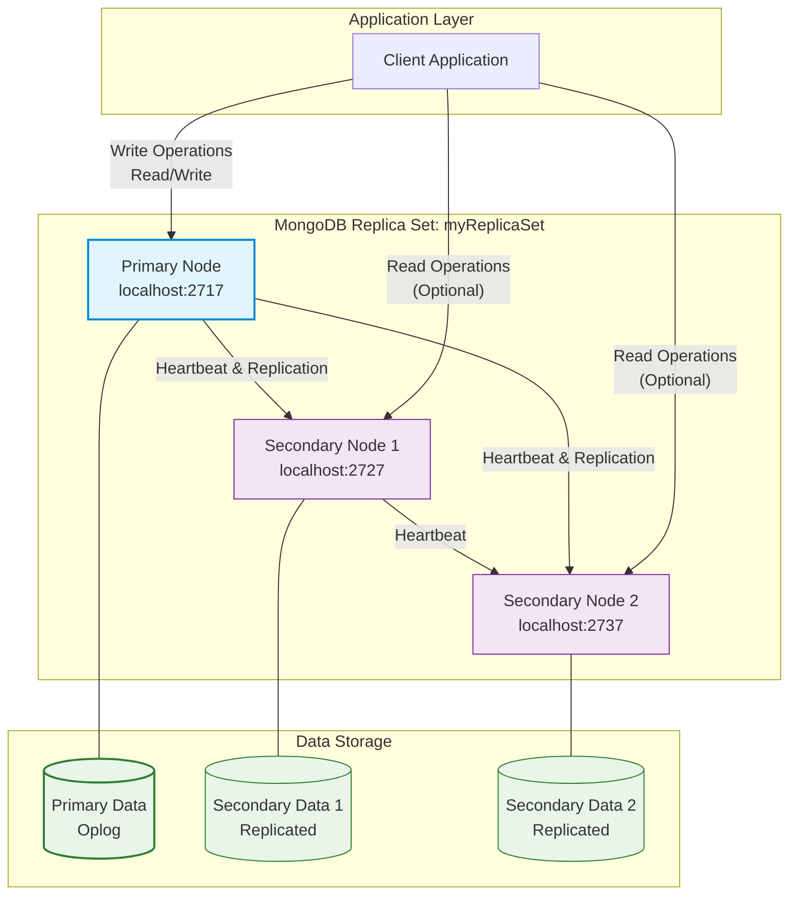

  

### 🛠️ Technical Explanation

This production architecture illustrates a **MongoDB Replica Set** with **three nodes** deployed on different ports on `localhost` (simulating separate servers).
---
- **🟢 Primary Node** (`localhost:2717`):  
  - Handles **all write operations**  
  - Coordinates **replication** to both Secondary nodes  
---
- **🔵 Secondary Nodes** (`localhost:2727` & `localhost:2737`):  
  - Serve **read operations** to distribute query load  
  - Receive data replicated from the Primary  
---
- **💓 Heartbeats & Cluster Health**:  
  - All nodes maintain **continuous communication**  
  - Enable **automatic failover** if the Primary goes down  
---
> ✅ This setup simulates a **production-ready MongoDB cluster**, providing **high availability**, **fault tolerance**, and **read scalability**.


  

## 2️⃣ Write Operation Flow

  

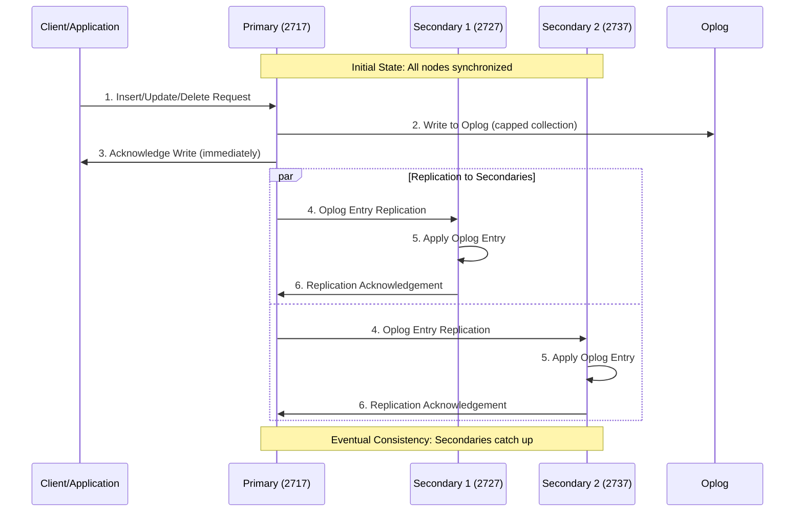

  
### 📝 Technical Explanation – Write Flow

Write operations in a **MongoDB Replica Set** follow a **specific flow** to ensure **data durability** and **performance**:
---
1. **🧑‍💻 Client → Primary**  
   - The client sends **write operations exclusively** to the **Primary node**  
---
2. **🗂️ Primary Oplog Logging**  
   - Primary writes the operation to its **Oplog** (operations log)  
   - The Oplog is a **capped collection** that tracks all data changes  
---
3. **✅ Primary Acknowledgment**  
   - Primary immediately **acknowledges the write** to the client  
   - Default **write concern** ensures confirmation without waiting for secondaries  
---
4. **🔄 Replication to Secondaries**  
   - Primary **asynchronously replicates** Oplog entries to all Secondary nodes  
---
5. **📥 Secondary Application**  
   - Each Secondary **applies operations in the same order** as the Primary  
---
6. **📤 Replication Acknowledgment**  
   - Secondaries **acknowledge replication completion** back to the Primary  

> ⚡ This flow ensures **durable writes** while maintaining **high performance** through **asynchronous replication**.


  

## 3️⃣ Automatic Failover & Election Process

  

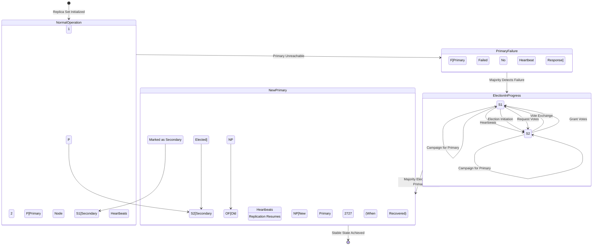

  

### 🛠️ Technical Explanation – Automatic Failover
---
MongoDB implements **automatic failover** through the **Raft consensus algorithm**, ensuring high availability:

1. **💓 Heartbeat Monitoring**  
   - All nodes exchange **heartbeats every 2 seconds** to monitor cluster health  
---
2. **⚠️ Failure Detection**  
   - If **Secondaries** don't receive a heartbeat from the **Primary** within **10 seconds**, they initiate an **election**  
---
3. **🏁 Election Process**  
   - **Eligible Secondaries** (priority > 0, not hidden, up-to-date oplog) campaign to become **Primary**  
   - Nodes **vote** based on election criteria:  
     - Priority  
     - Data freshness  
     - Network connectivity  
   - Candidate requires **majority vote** (`n/2 + 1`) to be elected  
---
4. **🌟 New Primary**  
   - The **elected node transitions to Primary**  
   - Resumes **replication** to remaining Secondaries  
---
5. **🔄 Old Primary Recovery**  
   - When a **failed node recovers**, it rejoins as a **Secondary**  
   - Syncs **missing data** to catch up with the current Primary  

> ⚡ Automatic failover ensures **high availability**, **data consistency**, and **minimal downtime** in a MongoDB Replica Set.


  

## 4️⃣ Data Replication Synchronization

  

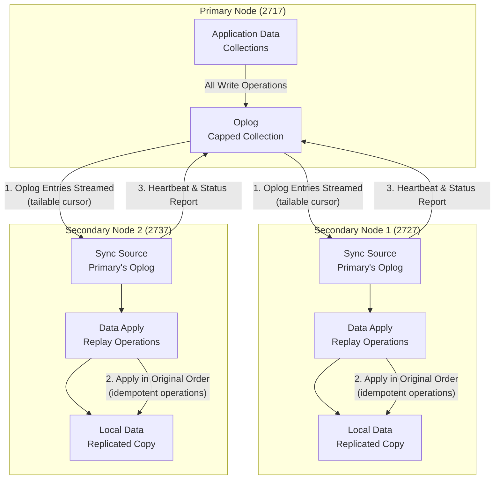

  

### 🔄 Technical Explanation – Data Replication in MongoDB

---
MongoDB uses a **pull-based replication model** via the **Oplog** to ensure data consistency across Replica Set nodes.
---

#### 🗂️ Oplog Structure
- A **capped collection** storing **idempotent operations** (`insert`, `update`, `delete`) with **timestamps**  
- Serves as the source for replication to Secondaries  

---

#### 🔁 Replication Process
1. **Secondaries** maintain a **tailable cursor** on the Primary's Oplog  
2. **New operations** are streamed to Secondaries **in real-time**  
3. Each Secondary applies operations **in the same order as the Primary**  

---

#### ⚡ Initial Sync
- New nodes perform:  
  - **Full data copy**  
  - **Oplog application** to catch up with Primary  

---

#### ✅ Consistency Guarantees
- Controlled by **write concern options**:  
  - `w: 1` → Acknowledged by Primary  
  - `w: majority` → Acknowledged by most nodes  
  - `w: all` → Acknowledged by all nodes  

---

#### 📊 Lag Monitoring
- `rs.status()` / `replSetGetStatus` shows **replication lag**  
- Optimal production lag: **< 50ms**  

---

### 🏗️ Production Best Practices (3-node Replica Set)
- **Write Concerns**: Use `w: "majority"` for critical data to ensure durability  
- **Read Preferences**:  
  - `primary` → Strong consistency  
  - `secondaryPreferred` → Read scaling  
- **Connection String**:  
```text
mongodb://localhost:2717,localhost:2727,localhost:2737/?replicaSet=myReplicaSet
