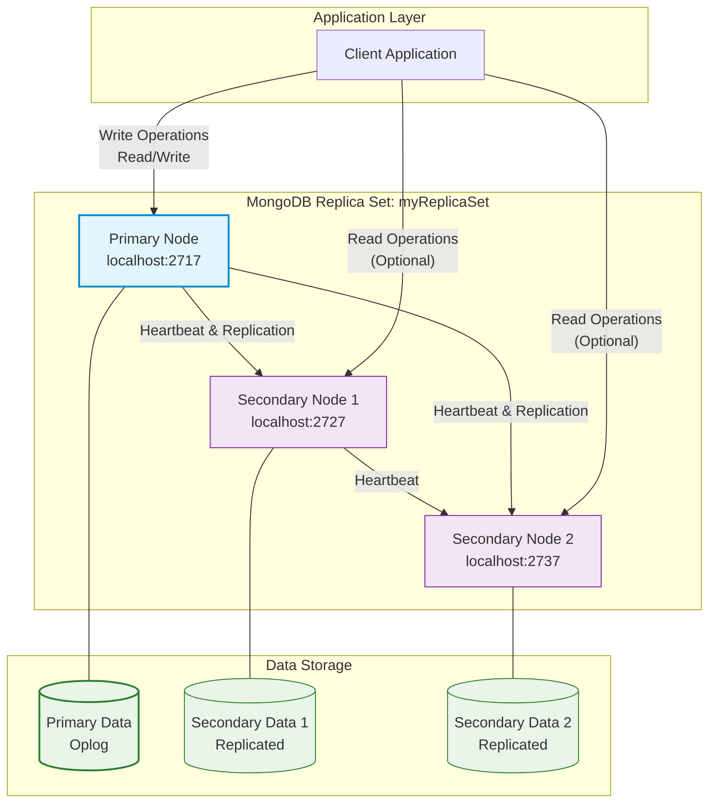
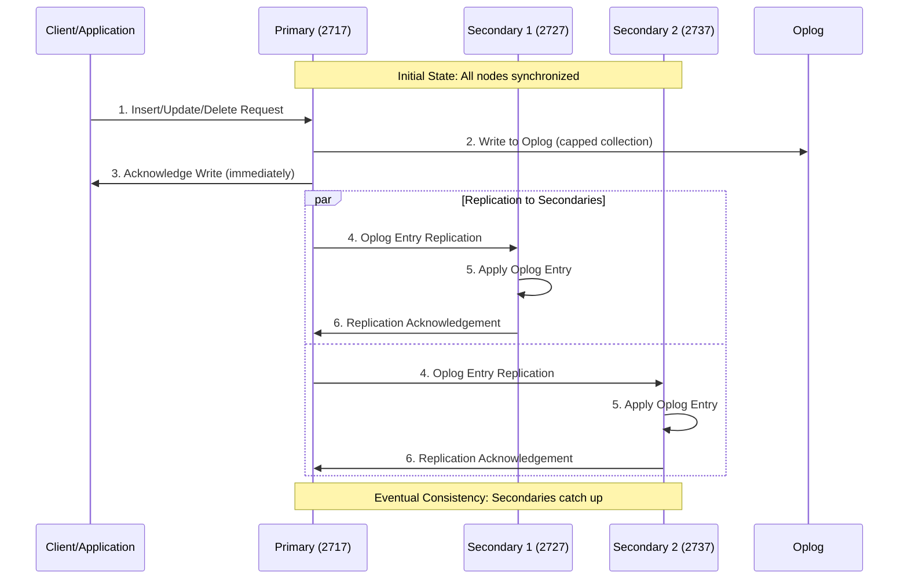
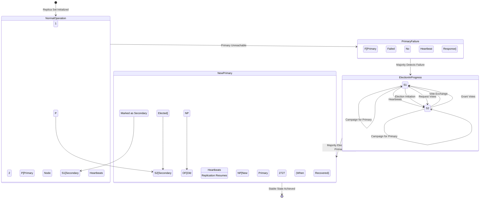
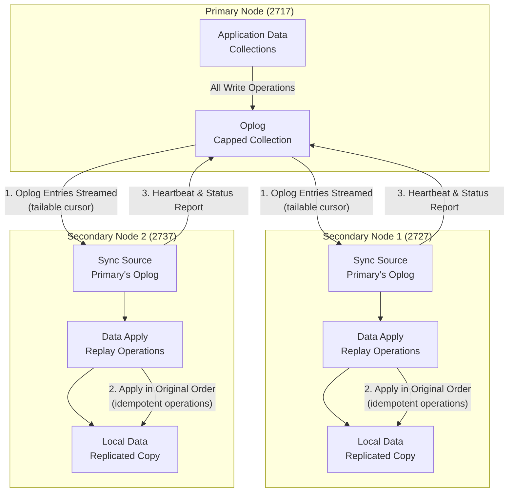

📘 Documentation – MongoDB Replica Set Setup Simulation (Production-Oriented)
=============================================================================

Replica Set Name: `myReplicaSet`
--------------------------------

* * *

1️⃣ Simulation Objective
------------------------

The objective of this simulation is to **set up and operate a MongoDB Replica Set cluster** in a production-like environment in order to:

*   Understand the roles of **Primary** and **Secondary** nodes
    
*   Observe **automatic elections**
    
*   Test **data replication**
    
*   Verify **write restrictions**
    
*   Diagnose **real-world production errors**
    

* * *

2️⃣ Environment Used
--------------------

Component

Value

OS

Windows

MongoDB

8.2.1

mongosh

2.5.8

Deployment Type

Local (simulation)

Mode

Replica Set

* * *

3️⃣ Connection to the Initial Primary Node
------------------------------------------

Connection to MongoDB server on port **2717**:

    mongosh --port 2717
    

Result:

*   Successful connection
    
*   Node is **Primary**
    
*   Active Replica Set: `myReplicaSet`
    

* * *

4️⃣ Initial Replica Set Status Check
------------------------------------

Executed command:

    rs.status()
    

### 🔍 Observation

*   `votingMembersCount: 1`
    
*   `stateStr: PRIMARY`
    
*   Only one active node
    
*   No fault tolerance yet
    

👉 The Replica Set is operational but **not redundant**

* * *

5️⃣ Adding Secondary Nodes
--------------------------

### ➕ Add first Secondary

    rs.add("localhost:2727")
    

### ➕ Add second Secondary

    rs.add("localhost:2737")
    

* * *

6️⃣ Cluster Status After Adding Nodes
-------------------------------------

    rs.status()
    

### 🔍 Result

Element

Value

Total nodes

3

Primary

localhost:2717

Secondary

localhost:2727

Secondary

localhost:2737

votingMembersCount

3

writeMajorityCount

2

✅ The cluster is now **highly available**

* * *

7️⃣ Shell Behavior Test (`rs.status` vs `rs.status()`)
------------------------------------------------------

Incorrect command:

    rs.status
    

Result:

*   Returns a **function reference**
    
*   No execution
    

Correct command:

    rs.status()
    

👉 This highlights the difference between:

*   **Function reference**
    
*   **Function execution**
    

* * *

8️⃣ Restart and Temporary Connection Loss
-----------------------------------------

Reconnection attempt:

    mongosh --port 2717
    

Result:

    MongoNetworkError: connect ECONNREFUSED
    

### 🔍 Interpretation

*   The node on port 2717 was **down**
    
*   The Replica Set triggered an **automatic election**
    

* * *

9️⃣ New Election Observation
----------------------------

Connection to another node:

    mongosh --port 2727
    

    rs.status()
    

### 🔍 Result

*   `localhost:2727` becomes **PRIMARY**
    
*   `localhost:2717` becomes **SECONDARY**
    
*   `term` incremented (moved to `term: 2`)
    

✅ **Fault tolerance confirmed**

* * *

🔟 Write Attempt on a Secondary (Expected Failure)
--------------------------------------------------

Connection to a Secondary:

    mongosh --port 2717
    

Insert attempt:

    db.users.insert({ "name": "my name is Ayoub" })
    

Result:

    MongoBulkWriteError[NotWritablePrimary]: not primary
    

### 🧠 Explanation

*   **Write operations are forbidden** on Secondary nodes
    
*   Only the **Primary** accepts writes
    

✅ Normal production behavior

* * *

1️⃣1️⃣ Data Insertion on the Primary
------------------------------------

Connection to the Primary:

    mongosh --port 2727
    

Successful insert:

    db.random.insertOne({ "name": "My name is Ayoub" })
    

Result:

    acknowledged: true
    

* * *

1️⃣2️⃣ Replication Verification
-------------------------------

Connection to a Secondary:

    mongosh --port 2717
    

    use Ayoub
    show collections
    

Result:

*   The `random` collection is present
    
*   Data has been **automatically replicated**
    

✅ Replication is functional

* * *

1️⃣3️⃣ Encountered Issue: BSON / UTF-8 Error
--------------------------------------------

Observed error:

    BSONError: Invalid UTF-8 string in BSON document
    

### 🔍 Identified Cause

*   MongoDB version **8.2**
    
*   Feature Compatibility Version:
    

    db.system.version.find()
    

    { version: "8.2" }
    

👉 Version is too recent → instability with some commands (`rs.status()`)

* * *

1️⃣4️⃣ Security Warnings (Non-Production Mode)
----------------------------------------------

At startup:

    Access control is not enabled
    Server is bound to localhost
    

### 🔐 Interpretation

*   No authentication enabled
    
*   Access restricted to `localhost`
    
*   Acceptable for **simulation**
    
*   ❌ Not recommended for production
    

* * *

1️⃣5️⃣ Results and Skills Acquired
----------------------------------

### ✅ Validated Skills

*   Replica Set setup
    
*   Dynamic node addition
    
*   `rs.status()` analysis
    
*   Election mechanism understanding
    
*   Handling `NotWritablePrimary` errors
    
*   Automatic data replication
    
*   BSON / FCV issue diagnostics
    

* * *

1️⃣6️⃣ Conclusion
-----------------

This simulation successfully reproduced a **production-like MongoDB environment**, demonstrating:

*   Real Replica Set behavior
    
*   High availability
    
*   Write limitations
    
*   Automatic elections
    
*   Version-related errors
    

It provides a **solid foundation** for backend, DevOps, and cloud projects.

* * *

📌 Future Improvements
----------------------

*   Enable authentication (`--auth`)
    
*   Add TLS/SSL
    
*   Downgrade FCV to 7.0
    
*   Dockerize the cluster
    
*   Add monitoring (Prometheus / MongoDB Compass)
    

* * *

If you want, I can now:

*   ✅ Convert this into a **GitHub README**
    
*   ✅ Adapt it to **OFPPT / ISTA academic format**
    
*   ✅ Add **architecture diagrams**
    
*   ✅ Polish it as **enterprise-grade documentation**
    

Just tell me 🔥

==============================================================

# MongoDB Replica Set Production Architecture

  

## 1️⃣ Production Architecture Overview

  

  

### Technical Explanation

This production architecture shows a MongoDB Replica Set with three nodes deployed across distinct ports on localhost (simulating separate servers). The Primary node (port 2717) handles all write operations and coordinates replication to both Secondary nodes (ports 2727 and 2737). Secondary nodes can serve read operations to distribute query load. All nodes maintain continuous communication through heartbeats to monitor cluster health and facilitate automatic failover if needed.

  

## 2️⃣ Write Operation Flow

  

  

### Technical Explanation

Write operations follow a specific flow in MongoDB Replica Sets:

1. Client sends write operations exclusively to the Primary node

2. Primary writes the operation to its Oplog (operations log), a capped collection that tracks all data changes

3. Primary immediately acknowledges the write to the client (default write concern)

4. Asynchronously, the Primary replicates Oplog entries to all Secondary nodes

5. Each Secondary applies the operations in the same order as the Primary

6. Secondaries acknowledge replication completion back to the Primary

  

This flow ensures data durability while maintaining write performance through asynchronous replication.

  

## 3️⃣ Automatic Failover & Election Process

  

  

### Technical Explanation

MongoDB implements automatic failover through the Raft consensus algorithm:

1. **Heartbeat Monitoring**: All nodes exchange heartbeats every 2 seconds

2. **Failure Detection**: If secondaries don't receive heartbeat from primary within 10 seconds, they initiate election

3. **Election Process**:

   - Eligible secondaries (priority > 0, not hidden, up-to-date oplog) campaign to become primary

   - Nodes vote based on election criteria (priority, data freshness, network connectivity)

   - Candidate needs majority vote (n/2 + 1) to become primary

4. **New Primary**: Elected node transitions to primary, resumes replication to remaining secondaries

5. **Old Primary Recovery**: When failed node recovers, it rejoins as secondary and syncs missing data

  

## 4️⃣ Data Replication Synchronization

  

  

### Technical Explanation

Data replication in MongoDB uses a pull-based model through the Oplog:

1. **Oplog Structure**: Capped collection storing idempotent operations (insert, update, delete) with timestamps

2. **Replication Process**:

   - Secondaries maintain a tailable cursor on the Primary's Oplog

   - New operations are streamed to Secondaries in real-time

   - Each Secondary applies operations in the same order as the Primary

3. **Initial Sync**: New nodes perform full data copy + Oplog application

4. **Consistency Guarantees**: Write concern options (w: 1, w: majority, w: all) control when writes are confirmed

5. **Lag Monitoring**: `replSetGetStatus` shows replication lag; optimal production should maintain < 50ms lag

  

## Production Best Practices Summary

  

**For your 3-node Replica Set:**

- **Write Concerns**: Use `w: "majority"` for critical data to ensure durability

- **Read Preferences**: Default `primary` for strong consistency; `secondaryPreferred` for read scaling

- **Connection String**: `mongodb://localhost:2717,localhost:2727,localhost:2737/?replicaSet=myReplicaSet`

- **Monitoring**: Track replication lag, election counts, and member states

- **Backup**: Always backup from a Secondary to avoid Primary performance impact

  

This architecture provides 99.9%+ availability, automatic failover, and data redundancy suitable for production workloads.
